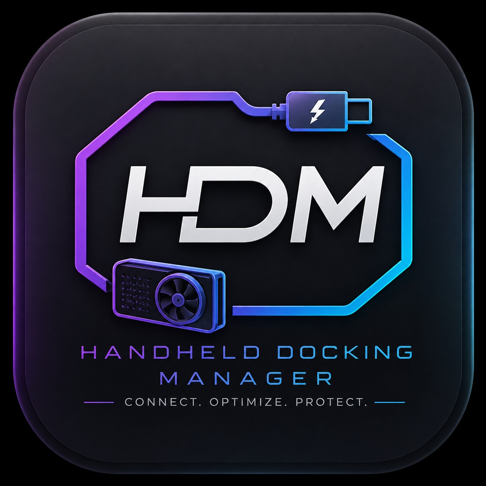

<div align="center">



# Handheld Dock Mode

**Safety-first dock mode for SteamOS handheld PCs**

Move between handheld and TV gaming with player-friendly modes while HDM verifies the GPU, display, Gamescope, game, and hardware state underneath.

[](https://github.com/ronnierosal/Handheld-Docked-Mode-SteamOS/actions/workflows/ci.yml) [](https://github.com/ronnierosal/Handheld-Docked-Mode-SteamOS/commits/main/)   [](LICENSE)

[Current status](#-current-status) · [Safety](#-safety-first) · [Development](#-development) · [Documentation](#-documentation)

</div>

> [!IMPORTANT]
> HDM is in active development and is not a general-availability release.
> Version 0.2.0 exposes diagnostics, G1 sleep protection, reviewed support
> bundles, supervised integration preparation, and explicitly approved guarded
> release of eligible non-game eGPU clients. It does **not** expose a display/GPU
> transition or authorize physical live eGPU removal.

> [!CAUTION]
> Physical live removal of the GPD G1 is unsupported. Restore internal
> operation and shut the handheld down before disconnecting it.

## 📖 About

Handheld Dock Mode (HDM) is a Decky Loader-native controller for a future
console-like docking experience on SteamOS handhelds. Players choose a desired
placement—such as **Portable** or **TV Docked**—instead of managing DRM
connectors, PCI addresses, GPU selectors, or Gamescope arguments.

The project is deliberately fail-closed. If HDM cannot prove the exact hardware,
active display, render GPU, game state, or rollback path, it reports the state
as unknown or degraded and blocks the action.

### ✨ What works today

- 🔎 Read-only discovery of the host, DRM devices and connectors, Gamescope,
  Steam game scopes, PCI topology, USB4 topology, and exact G1 clients
- 🧭 Confidence-aware placement inference without hard-coded card numbers,
  connector suffixes, or PCI bus addresses
- 🛡️ Two-layer sleep protection while the certified G1 is attached: a bounded
  login1 inhibitor and Steam's native preflight blocker
- 📦 Preview, copy, and token-approved save of a bounded, redacted support bundle
- 📊 Adaptive Decky polling, collection timings, and an optional troubleshooting
  overlay
- 🧪 Deterministic transition, rollback, crash-recovery, process-release, sleep,
  compatibility, and failure-injection simulations
- 🔧 Explicitly approved preparation of the reversible Gamescope integration
  used for supervised display validation
- 🧹 Redacted inspect/confirm flow for graceful release of exact eligible
  non-game eGPU clients, with separately confirmed force escalation

Preparation only installs, reloads, and verifies the fixed integration boundary.
It cannot restart Gamescope, switch a display, or select a GPU.

## 🚦 Current status

HDM `0.2.0` is a development build. The implementation is intentionally split
between production-safe features and dormant or simulated transition work.

| Capability | Evidence | Availability |
|---|---|---|
| Decky lifecycle and typed RPC | Implemented and hardware tested | Available |
| Read-only Ally X / G1 discovery | Implemented and hardware tested | Available |
| Portable placement inference | Implemented and hardware tested | Available |
| G1 sleep inhibitor and Steam preflight | Implemented and hardware tested | Available; persistent warning needs one final supervised visible proof |
| Redacted support preview, one-shot game/GPU evidence, and approved save | Implemented and simulated | Available; new evidence and controller-visible save acceptance are pending hardware proof |
| Docked-iGPU natural-exit observer | Implemented and simulated | Read-only categorical status available in troubleshooting; hardware proof pending |
| Temporary verbose diagnostics | Implemented and simulated | Explicit controller consent, bounded countdown, disable control, and reboot reset available; visible acceptance pending |
| Gamescope integration preparation | Implemented and simulated | Available only through an explicit, short-lived approval |
| Portable ↔ TV Docked transition engine | Implemented and simulated | Not wired to Decky; no transition RPC exists |
| Guarded process release | Implemented and simulated | Decky-native experimental flow; supervised disposable-process proof pending |
| Physical G1 live removal | Known unsafe/unsupported | Not available |
| Automatic docking | Planned | Not available |

The next release-facing gate is supervised validation of the corrected blocked-
Sleep warning and the controller-visible support preview/save flow. Native HDM
TV Docked transition validation remains pending.

See the [authoritative roadmap](docs/ROADMAP.md) for the complete evidence ledger
and ordered milestones.

## 🕹️ Player-facing placements

HDM keeps observed placement separate from workflow progress so a pending or
failed action can never overwrite hardware truth.

| Placement | Meaning | Current state |
|---|---|---|
| **Portable** | Internal GPU → internal panel | Hardware tested |
| **Boosted Handheld** | Verified eGPU → internal panel | Unproven |
| **Docked-iGPU** | Internal GPU → external display | Read-only observer implemented; placement remains unverified |
| **TV Docked / Docked-eGPU** | Verified eGPU → its directly attached display | Transition simulated; native hardware proof pending |

Incomplete or conflicting evidence is surfaced as **Unknown** or **Degraded**.
Workflow phases such as Connecting, Action Required, and Failure remain a
separate axis.

## 🛡️ Safety first

Every future transition follows one journaled, verifiable path:

```text
DETECT → VALIDATE → PLAN → PREPARE → APPLY → VERIFY → COMMIT
                                      │
                                      └─ failure → ROLL BACK or retain known-good state
```

The core rules are simple:

- Never migrate a running workload between GPUs.
- Block a Gamescope restart while a game is running—or when game state is
  unknown.
- Treat connector names, DRM card numbers, and PCI addresses as observations,
  never stable identity.
- Revalidate exact hardware and user intent immediately before any approved
  mechanism.
- Require a verified result before declaring a transition complete.
- Preserve a known-good state or execute bounded rollback on failure.
- Never treat cleared software clients as proof that physical eGPU removal is
  safe.
- Redact hostnames, addresses, home paths, and unique hardware identifiers from
  support data by default.

The complete release gates live in [Safety invariants](docs/SAFETY_INVARIANTS.md).

## 🧩 Hardware support

The first certified identity profile is intentionally narrow:

| Component | Profile |
|---|---|
| Handheld | ASUS ROG Ally X running SteamOS |
| eGPU | GPD G1 with AMD Radeon RX 7600M XT (`1002:7480`) |
| Display | TV connected directly to the G1 |

Certification is capability-specific. Exact identity, read-only discovery,
Portable inference, and the sleep guard have hardware evidence; this does not
certify display handoff, Boosted Handheld, or live removal. Other hosts, eGPUs,
and SteamOS versions are not promoted by similarity.

See [Hardware support](docs/HARDWARE_SUPPORT.md) and the
[dated validation record](docs/HARDWARE_VALIDATION_2026-08-31.md) for the exact
evidence and known limitations.

## 💾 Installation

There is no public release or supported end-user installer yet. Current builds
are development artifacts for controlled validation through Decky Loader's
native lifecycle. Do not copy files into a running plugin or combine frontend
and backend artifacts from different commits.

Each successful CI run retains one **controlled validation artifact** for 14
days. It contains the ZIP, its SHA-256 manifest, and the exact source revision;
it is not a GitHub Release, public installer, or automatic deployment. Use it
only when its workflow commit, `source-revision.txt`, and the installed QAM
**HDM build** label agree.

Hardware validation must follow the staged
[deployment and validation strategy](docs/DEPLOYMENT_VALIDATION.md), beginning
with one clean, provenance-recorded package and the G1 disconnected.

## 🛠️ Development

### Prerequisites

- Python 3.11 or newer
- Node.js 24
- pnpm 11.19.0

Install the frontend dependencies:

```bash
pnpm install --frozen-lockfile
```

Run the complete local verification matrix:

```bash
python scripts/check_architecture.py
python -m unittest discover -s tests -v
python -m compileall -q backend tests scripts
pnpm typecheck
pnpm test:frontend
pnpm build
python scripts/check_plugin_package.py .
```

Build the deterministic Decky archive:

```bash
python scripts/build_plugin.py
```

The package is written to `out/HandheldDockMode-0.2.0.zip`. Never deploy if a
check fails, the worktree contains unexplained changes, or artifact provenance
cannot be matched to one commit.

### Read-only diagnostics

Emit a local SteamOS snapshot:

```bash
PYTHONPATH=backend python -m hdm.cli
```

Capture bounded, redacted state from an installed Ally without writing a remote
file:

```bash
python scripts/remote_capture.py --host <ally-ip> --identity-file <ssh-key>
```

The production plugin exposes no general-purpose command endpoint. Root access
is constrained to the documented observation, sleep-protection, support-export,
and supervised preparation boundaries.

## 🏗️ Architecture

```text
Decky UI / diagnostics CLI
            │
      application services
       ╱             ╲
read-only snapshot   guarded transition engine
       ╲             ╱
        pure domain policy
          ╱        ╲
 SteamOS adapters  hardware profiles
```

`backend/hdm/domain` is pure policy with no filesystem, subprocess, network, or
operating-system calls. Mechanisms live behind narrow ports, hardware
capabilities come from exact profiles, and public Decky RPCs are checked against
an explicit allowlist.

HDM is a new SteamOS-first implementation. eGPUBridge supplied useful hardware
evidence, but its architecture and behavior are not inherited as proof.

## 📚 Documentation

| Topic | Document |
|---|---|
| Product scope and placements | [Product definition](docs/PRODUCT.md) |
| Non-negotiable release gates | [Safety invariants](docs/SAFETY_INVARIANTS.md) |
| Components and state model | [Architecture](docs/ARCHITECTURE.md) |
| Evidence and ordered milestones | [Authoritative roadmap](docs/ROADMAP.md) |
| Certified identities and limitations | [Hardware support](docs/HARDWARE_SUPPORT.md) |
| Deployment stages and stop conditions | [Deployment validation](docs/DEPLOYMENT_VALIDATION.md) |
| Redacted diagnostic contract | [Diagnostics](docs/DIAGNOSTICS.md) |
| Support preview and export | [Support bundle](docs/SUPPORT_BUNDLE.md) |
| Remote read-only capture | [Remote validation](docs/REMOTE_VALIDATION.md) |
| Transition safety and recovery | [Experimental transitions](docs/EXPERIMENTAL_TRANSITIONS.md) |
| Sleep request policy | [Sleep workflow](docs/SLEEP_WORKFLOW.md) |
| Verified game-save boundary | [Game save](docs/GAME_SAVE.md) |
| Process-release boundary | [Process release](docs/PROCESS_RELEASE.md) |

Additional design records and compatibility documents are available in
[`docs/`](docs/).

## 🤝 Contributing

Contributions should preserve the safety invariants, pure-domain boundary, and
fail-closed defaults. Keep changes narrow, add deterministic regression coverage,
and run the full verification matrix before opening a pull request.

Hardware-affecting changes require an explicit milestone decision, supervised
execution, rollback coverage, and redacted before/live/after evidence.

## 📜 Licensing

HDM's community distribution is licensed under the
[GNU General Public License version 3 or later](LICENSE) (`GPL-3.0-or-later`).
Commercial/OEM integration, redistribution, bundling, customization, support,
or branding under terms outside GPLv3+ requires a separate negotiated license;
see [licensing](docs/LICENSING.md). Third-party notices remain in
[THIRD_PARTY_NOTICES.md](THIRD_PARTY_NOTICES.md).
